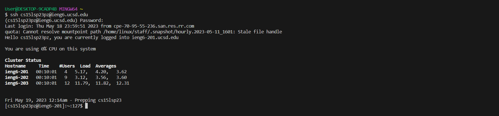
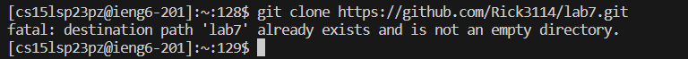
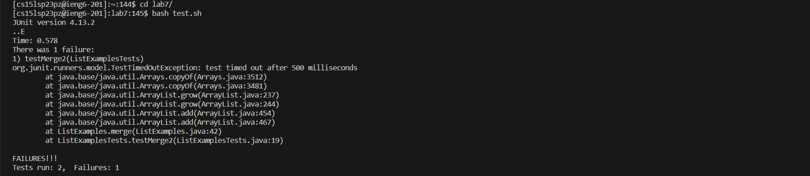
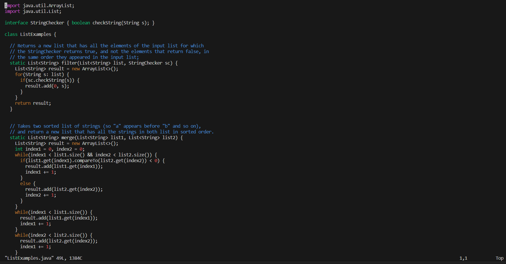
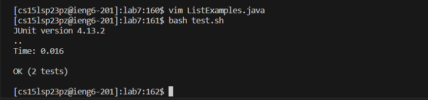

# Lab Report 4 

## Step 4: Logging Into ieng6 Account: 
To login into the ieng6 account you type the following into the terminal: `ssh <space> username@ieng6.ucsd.edu <enter>`. You will then be asked to put in your password so do as instructed: `password <enter>`. 

**Terminal View:** 


## Step 5: Cloning Fork: 
For this step I am assuming that the fork of the repository from Github is copied onto your clipboard. On the terminal type in the following: `git <space> clone <space> <ctrl v> <enter>`. 

**Terminal View:** \
 \
**If cloning for the first time it should show cloning instead of "lab7 already exsits"** 

## Step 6: Running The Tests 
To run the test we must first enter the lab7 directory, to do this the following must be put in the terminal: `cd <space> lab7/ <enter>`. Then to actually run the tests insert this command into the terminal: `bash <space> test.sh <enter>`. 

**Terminal View:** 


## Step 7: Fixing The Failing Tests
To fix the failing test we must edit `ListExamples.java` in `vim`, to do this inser these commands in the terminal: `vim <space> ListExamples.java`. 

**Terminal View In Vim:** 


Once in vim we have to change the index1 at the bottom to index2 to fix the failing test. To do this follow the given commands:
```
</> <+> <enter> <n> <n> <n> <left> <left> <x> <i> <2> <esc> <:wq> <enter>
```

**Updated Fixed Code In Vim:** 


## Step 8: Succeeding Tests 
To run the tests once more use the following commands: `bash <space> test.sh`.
 

## Step 9: Commit and Push 

