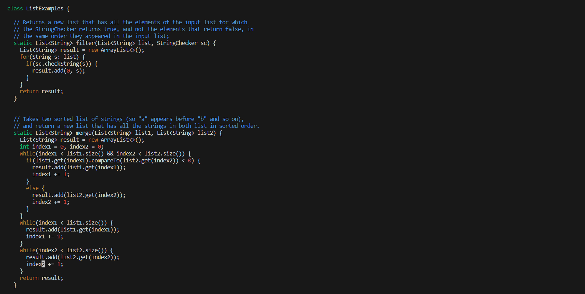

## Step 4: Logging Into ieng6 Account: 
To login into the ieng6 account you type the following into the terminal: `ssh <space> username@ieng6.ucsd.edu <enter>`. Password is no longer needed. 

**Terminal View:** 


## Step 5: Cloning Fork: 
For this step copy the `ssh link` from the GitHub repository onto your clipboard. On the terminal type in the following: `git <space> clone <space> <ctrl v> <enter>`. 

**Terminal View:** \
 \

## Step 6: Running The Tests 
To run the test we must first enter the lab7 directory, to do this the following must be put in the terminal: `cd <space> lab7/ <enter>`. Then to actually run the tests insert this command into the terminal: `bash <space> test.sh <enter>`. 

**Terminal View:** 


## Step 7: Fixing The Failing Tests
To fix the failing test we must edit `ListExamples.java` in `vim`, to do this insert these commands in the terminal: `vim <space> ListExamples.java`. 

**Terminal View In Vim:** 


Once in vim we have to change the index1 at the bottom to index2 to fix the failing test. To do this follow the given commands:
```
</> <+> <enter> <n> <n> <n> <left> <left> <x> <i> <2> <esc> <:wq> <enter>
```

**Updated Fixed Code In Vim:** 


## Step 8: Succeeding Tests 
To run the tests once more use the following commands: `bash <space> test.sh`.
 

## Step 9: Commit and Push 

**Commit:** \
To save the changes done in vim to the repository we have to commit them. To do this first we must use `git <space> add <space> ListExamples.java <enter>` to update the change that will be committed to the file. Once this is done we commit using `git <space> commit <space> -m <space> "message of choice" <enter>`. 

**Terminal View:** \


**Push:** \
Once commit is done the next step is to push the changes to the repository in GitHub. To do this we use the command `git <space> push <space> origin <space> main <enter>`. 

**Terminal View:** \


**Before Push:**  


**After Push:**  


